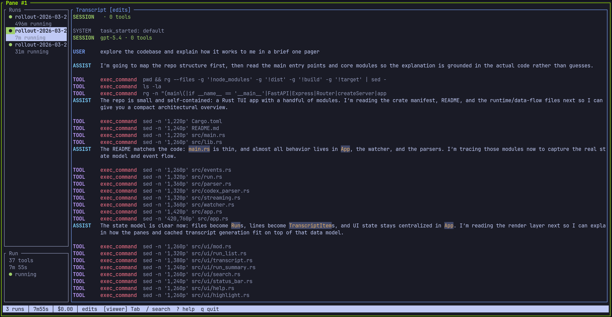

# loupe

A terminal viewer for [Claude Code](https://claude.ai/claude-code) headless sessions.

Headless LLM sessions are everywhere now — autonomous research loops, CI agents, overnight batch jobs. You kick off `claude -p` with `--output-format stream-json` and walk away. But then you want to check in. What's it doing? Is it stuck? Did it finish? The interactive TUI isn't available in headless mode, and `tail -f | jq` gets old fast.

Loupe gives you a read-only TUI over those JSONL logs. Point it at a directory, get a navigable transcript with live streaming, tool call detail, subagent tracking, and search — across as many sessions as the loop has produced.

```
loupe ./autoroute/logs/
```



## Install

```bash
# From source
cargo install --path .

# Nix
nix build github:toda/loupe
# or add to your flake inputs
```

## Usage

```bash
# Watch a log directory
loupe path/to/logs/

# Typical setup: run your loop in one pane, loupe in another
scripts/autoroute-loop.sh &
loupe autoroute/logs/
```

Loupe watches the directory for `.jsonl` files. Each file is a run. New files and appends are picked up automatically — no restart needed.

The JSONL format is what Claude Code produces with `--output-format stream-json --verbose --include-partial-messages`. Streaming text appears token-by-token with a `▌` cursor; completed messages replace the partial when done.

## Keybindings

| Key | Action |
|-----|--------|
| `Tab` | Switch focus between run list and transcript |
| `j`/`k`, arrows | Scroll transcript or select run (depends on focus) |
| `g`/`G` | Jump to top / bottom |
| `f` | Follow mode — stick to the latest output |
| `Enter` | Expand/collapse tool call details |
| `/` | Search within current run |
| `n`/`N` | Next / previous match |
| `?` | Help |
| `q` | Quit |

## How it works

Loupe is a viewer, not a process manager. It doesn't spawn Claude — your existing scripts do that. Loupe watches the output.

Two async tasks feed a render loop:

- A **file watcher** (via `notify`) detects new and modified `.jsonl` files, incrementally parses them, and sends structured events through a channel.
- A **crossterm event stream** captures keyboard input.

The main loop receives both, updates state, and renders at 10fps with a dirty flag so idle CPU is near zero.

Parsing has two tiers: **Tier 1** (stateless) reconstructs the full transcript from `system`, `assistant`, `user`, and `result` events. **Tier 2** (stateful) buffers `stream_event` text deltas for live token streaming on the active run.

## Run status

| Icon | Meaning |
|------|---------|
| `●` | Running — receiving events |
| `✓` | Completed — session exited cleanly |
| `✗` | Failed — session exited with an error |
| `?` | Unknown — no result event (killed session, or stale >60s) |

## License

MIT
